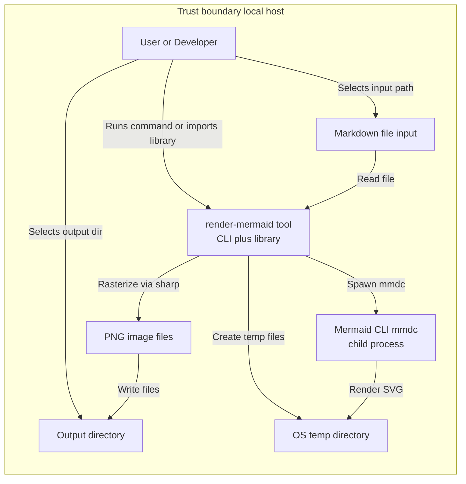
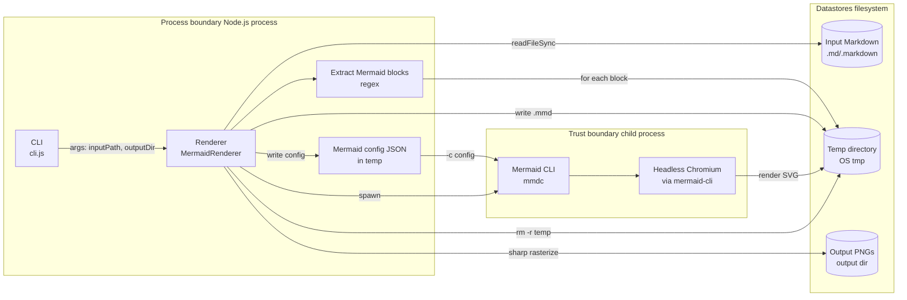
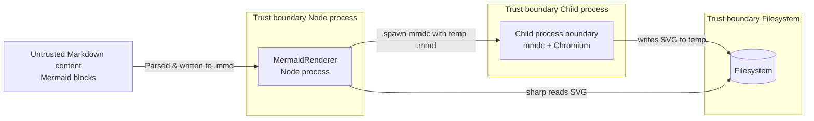
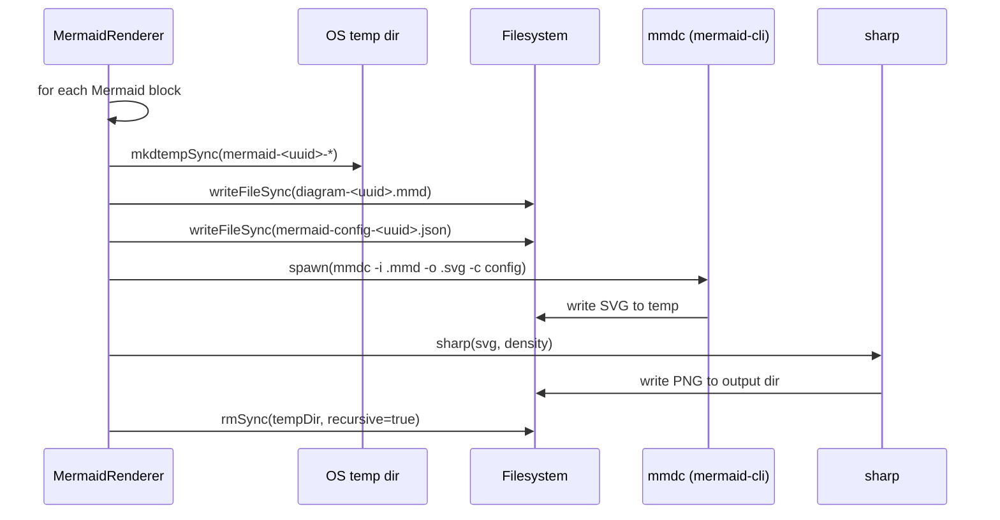
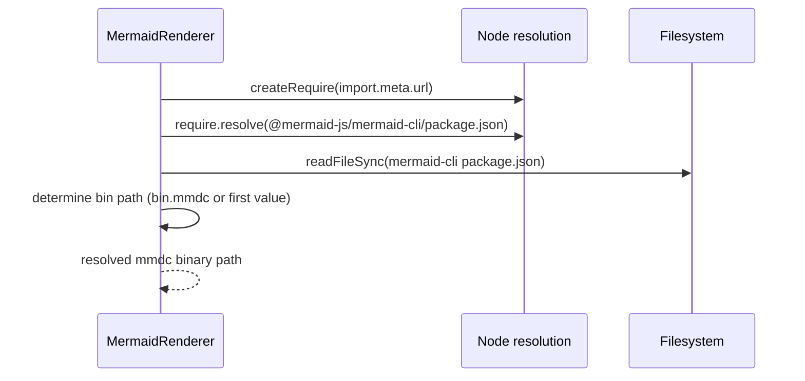

# Threat Model Review - 2026-02-25

## 0. Executive summary

- Primary risk is **rendering untrusted Mermaid/Markdown**: the tool spawns `mmdc` (Mermaid CLI) which typically uses headless Chromium; if run on untrusted content (e.g., CI on PRs), this raises **RCE / sandbox escape / DoS** concerns.
- Primary supply-chain risk is **dependency compromise** (especially `@mermaid-js/mermaid-cli` and `sharp`) because this project executes/loads them locally ([package.json](../package.json#L57-L60), [render-mermaid.js](../render-mermaid.js#L5-L7)).
- Strong baseline hygiene: input file existence/type checks and Markdown extension allow-list ([render-mermaid.js](../render-mermaid.js#L14-L26)); temp directories are cleaned up in `finally` ([render-mermaid.js](../render-mermaid.js#L74-L90)); outputs are random UUID-named, reducing overwrite/collision risk ([render-mermaid.js](../render-mermaid.js#L67-L73)).
- Biggest unknown: whether you intend this to run **only on a developer workstation** (trusted docs) or in **automation on attacker-controlled docs** (PRs, issues, uploaded docs).
- Next actions: clarify trust assumptions; document “safe usage” guidance; add guardrails if untrusted input is in-scope (sandbox, resource limits, network restrictions).

## 1. Scope

### In-scope components/containers

- CLI entrypoint: [cli.js](../cli.js#L1-L66)
- Library entrypoint: [index.js](../index.js#L1-L4)
- Renderer implementation: [render-mermaid.js](../render-mermaid.js#L1-L164)
- Dependencies executed/loaded:
  - `@mermaid-js/mermaid-cli` (invoked via `spawn`): [package.json](../package.json#L57-L60), [render-mermaid.js](../render-mermaid.js#L96-L153)
  - `sharp` (native image processing): [package.json](../package.json#L57-L60), [render-mermaid.js](../render-mermaid.js#L155-L161)

### Out-of-scope

- Any external service/API, because none exist in this repo (this is a local CLI/library per [README.md](../README.md#L11-L33)).
- GitHub Actions/CI for this repo (no workflows found under `.github/workflows`).

### Trust boundaries

- Local host boundary: user shell + filesystem + Node process.
- Child process boundary: `mmdc` (and its runtime, typically headless Chromium).
- Supply chain boundary: NPM packages pulled into `node_modules`.

### Key assets (with sensitivity)

- Input Markdown file contents (may include secrets/PII): **Confidential/Restricted** depending on user content ([render-mermaid.js](../render-mermaid.js#L37-L38)).
- Generated PNG files (may encode sensitive content): **Confidential/Restricted** depending on diagrams ([render-mermaid.js](../render-mermaid.js#L67-L73)).
- Temp directory contents (raw `.mmd`, config JSON, intermediate SVG): **Confidential** (contains diagram source and output) ([render-mermaid.js](../render-mermaid.js#L68-L72), [render-mermaid.js](../render-mermaid.js#L74-L90)).
- Local execution environment (developer machine / CI runner): **Restricted** (compromise impact is high).
- Dependency integrity (`node_modules`): **Restricted**.

## 2. Assumptions & Unknowns

- **ASSUMPTION:** This tool is primarily used **locally by developers** on their own Markdown files (per CLI/library examples in [README.md](../README.md#L11-L33)).
- **UNKNOWN:** Will this ever run on **untrusted input** (e.g., CI rendering docs from forks/PRs, web service wrapper, docs portal)?
  - Who can confirm: maintainer/release owner.
  - Question: “Do we render Mermaid from external contributors or uploaded files?”
- **UNKNOWN:** Does `@mermaid-js/mermaid-cli` in your environment launch Chromium with sandboxing enabled, and does rendering require outbound network?
  - Who can confirm: build/CI owner.
  - Where to look: `@mermaid-js/mermaid-cli` documentation and the runtime flags used by `mmdc`.
- **UNKNOWN:** Intended security posture for output directory writes (e.g., forbid writing outside workspace? allow absolute paths?).
  - Who can confirm: product owner / CLI UX owner.

## 3. Architecture & Data Flows (with tool-validated diagrams)

### 3.1 DFD Level 0 (Context)

**Evidence**

- CLI accepts input/output args and constructs renderer: [cli.js](../cli.js#L21-L45)
- Reads markdown and extracts Mermaid blocks: [render-mermaid.js](../render-mermaid.js#L37-L61)
- Creates temp directory/files, calls conversion, then deletes temp: [render-mermaid.js](../render-mermaid.js#L63-L94)
- Spawns `mmdc` and converts SVG->PNG using `sharp`: [render-mermaid.js](../render-mermaid.js#L117-L161)

### 3.2 DFD Level 1 (Subsystems / Containers)

**Evidence**

- Block extraction regex: [render-mermaid.js](../render-mermaid.js#L52-L61)
- Temp files and cleanup: [render-mermaid.js](../render-mermaid.js#L67-L90)
- Child process invocation: [render-mermaid.js](../render-mermaid.js#L117-L135)
- SVG->PNG conversion and optional resize: [render-mermaid.js](../render-mermaid.js#L155-L161)

### 3.3 Supporting diagrams

#### Trust boundary view

**Evidence**

- Untrusted content source is the Markdown file read into memory: [render-mermaid.js](../render-mermaid.js#L37-L38)
- Boundary crossing occurs when spawning `mmdc`: [render-mermaid.js](../render-mermaid.js#L132-L135)

## 4. Key Flows (ranked)

1) **Render Mermaid blocks from local Markdown**
- Description: Read Markdown, extract Mermaid blocks, render each to PNG.
- Data elements: diagram text (potentially sensitive), intermediate SVG, final PNG.
- Entry points: CLI args `inputPath`, `outputDir` ([cli.js](../cli.js#L31-L46)).
- Enforcement points: file exists/is file, extension allow-list (.md/.markdown) ([render-mermaid.js](../render-mermaid.js#L14-L26)).

2) **Spawn and execute `mmdc` (mermaid-cli) on attacker-controlled diagram text**
- Description: Write `.mmd` to temp directory and spawn `mmdc` to render SVG.
- Data elements: `.mmd` and config JSON in temp directory.
- Enforcement points: none specific to diagram content; diagram text is passed through verbatim ([render-mermaid.js](../render-mermaid.js#L74-L87), [render-mermaid.js](../render-mermaid.js#L117-L135)).

3) **Resolve `mmdc` binary path from installed dependency**
- Description: Resolve `@mermaid-js/mermaid-cli/package.json`, read it, and determine the `bin` path.
- Data elements: dependency metadata from `node_modules`.
- Enforcement points: throws if bin path can’t be determined ([render-mermaid.js](../render-mermaid.js#L110-L115)).

## 5. Threats

| ID | Flow | Summary | STRIDE | OWASP | Likelihood | Impact | Status | Rationale |
|---:|------|---------|--------|-------|------------|--------|--------|-----------|
| T01 | 2 | Malicious Mermaid triggers `mmdc`/Chromium exploit (RCE) | EoP | A06/Vulnerable Components | M | H | Unknown | Risk depends on whether input is untrusted and on mermaid-cli/Chromium hardening. |
| T02 | 2 | Mermaid rendering causes DoS (CPU/memory blowup, huge SVG) | DoS | A04/Insecure Design | H | M | Open | No resource/time limits around rendering per block. |
| T03 | 2 | Unexpected outbound network usage during render (SSRF-like) | InfoDisc | A10/SSRF (analogy) | L-M | M | Unknown | Depends on mermaid-cli behavior and diagram features; not constrained here. |
| T04 | 1 | Sensitive diagram contents leak via temp files (before cleanup) | InfoDisc | A02/Crypto Failures (analogy) | M | M | Partially mitigated | Temp dirs are removed in `finally`, but crash/power-loss may leave artifacts. |
| T05 | 1 | Output directory misuse (writing to sensitive locations) | Tampering | A05/Security Misconfig | M | M | Open | Caller controls `outputDir`; tool will create it and write files there. |
| T06 | 3 | Dependency compromise (mermaid-cli/sharp) leads to code execution | EoP | A08/Software Integrity Failures | M | H | Open | Project executes/loads dependencies directly. |
| T07 | 1 | Path confusion / symlink attacks in temp or output dirs | Tampering | A01/Broken Access Control (analogy) | L-M | M | Unknown | OS semantics; no explicit anti-symlink measures. |
| T08 | 1 | Repudiation: no audit trail for what was rendered/written | Repudiation | A09/Logging Failures | L | L-M | Open | No structured logs; mostly stdout and inherited child output. |
| T09 | 2 | Child process output leaks sensitive info to console logs | InfoDisc | A09/Logging Failures | M | L-M | Open | `stdio: 'inherit'` forwards mmdc output to parent console. |
| T10 | 1 | Malformed Markdown causes unexpected behavior or crashes | DoS | A04/Insecure Design | M | L | Mitigated | File type checks and regex extraction reduce some classes; still can fail on edge cases. |

## 6. Mitigations

| Threat ID | Mitigation | Status | Location/Evidence | Notes/Open questions |
|---:|------------|--------|------------------|---------------------|
| T01 | Treat Mermaid input as untrusted; sandbox `mmdc` runtime when applicable | UNKNOWN | N/A | Confirm whether this is used in CI on untrusted docs; if yes, run in locked-down container/VM. |
| T02 | Add resource limits (timeout per block; max blocks; max file size; optional max SVG size) | ABSENT | N/A | Consider exposing options in CLI/library (S/M effort depending on API decisions). |
| T03 | Document/ensure “no network during render” (or run with network blocked) | UNKNOWN | N/A | If running in CI, prefer egress-restricted environment. |
| T04 | Temp directory cleanup in `finally` | PRESENT | [render-mermaid.js](../render-mermaid.js#L74-L90) | Residual risk remains on abrupt termination; consider temp-on-ramdisk if needed. |
| T05 | Validate input path exists, is file, and is `.md/.markdown` | PRESENT | [render-mermaid.js](../render-mermaid.js#L14-L26) | Output directory is not constrained; clarify intended behavior. |
| T06 | Resolve `mmdc` from dependency instead of PATH | PRESENT | [render-mermaid.js](../render-mermaid.js#L96-L115) | Still depends on `node_modules` integrity; add lockfile + CI SCA/SBOM for stronger posture. |
| T09 | Child process output inherits stdio | PRESENT | [render-mermaid.js](../render-mermaid.js#L132-L135) | Consider making stdio configurable for CI to avoid leaking content. |
| T10 | Regex-based fenced block extraction for Mermaid | PRESENT | [render-mermaid.js](../render-mermaid.js#L52-L61) | Doesn’t validate Mermaid syntax; relies on mmdc errors. |

## 7. High-risk interaction sequences (top 2–3, tool-validated)

### 7.1 CLI invocation and file validation

```mermaid
sequenceDiagram
  participant U as User or Developer
  participant CLI as CLI (cli.js)
  participant R as MermaidRenderer
  participant FS as Filesystem

  U->>CLI: render-mermaid <input.md> [output-dir]
  CLI->>R: new MermaidRenderer(inputPath, outputDir)
  R->>FS: existsSync + statSync(inputPath)
  R->>FS: readFileSync(inputPath)
  R->>R: extractMermaidBlocks()
  CLI->>R: run()
  R-->>CLI: Promise resolved
  CLI-->>U: exit code 0
```

**Evidence**

- CLI constructs renderer and calls `run`: [cli.js](../cli.js#L39-L45)
- File checks and read: [render-mermaid.js](../render-mermaid.js#L14-L38)

### 7.2 Rendering a block (temp files → mmdc → sharp)

**Evidence**

- Temp creation + writes + cleanup: [render-mermaid.js](../render-mermaid.js#L67-L90)
- Spawn and arguments: [render-mermaid.js](../render-mermaid.js#L117-L135)
- SVG->PNG with `sharp`: [render-mermaid.js](../render-mermaid.js#L155-L161)

### 7.3 Resolving the `mmdc` binary from dependency metadata (supply-chain sensitive)

**Evidence**

- Resolution and parsing logic: [render-mermaid.js](../render-mermaid.js#L96-L115)

## 8. Validation plan (no code)

1) **Untrusted-input decision test**
- Intent: confirm whether untrusted Mermaid is in-scope.
- Steps: document intended usage contexts (local docs only vs CI on PRs) in an issue/ADR.
- Evidence: link to decision record; list of pipelines/consumers.
- Owner: maintainer.

2) **DoS / resource exhaustion test**
- Preconditions: run on a non-prod machine/runner.
- Steps: render a Markdown containing many large/complex Mermaid diagrams; observe CPU/memory/time.
- Expected: acceptable runtime or documented failure mode.
- Evidence: timing logs; resource graphs.
- Owner: maintainer / CI owner.

3) **Temp artifact leakage test**
- Steps: kill the process mid-render (SIGKILL/terminate) and check OS temp directory for leftovers.
- Expected: either no artifacts or documented cleanup guidance.
- Evidence: filesystem listing/screenshot.
- Owner: maintainer.

4) **Network egress test (if CI/untrusted is in scope)**
- Steps: run render inside an egress-restricted environment; confirm it still works.
- Expected: rendering succeeds without outbound access, or behavior is documented.
- Evidence: firewall logs / runner policy outputs.
- Owner: CI owner.

5) **Supply chain posture check**
- Steps: confirm lockfile usage in consumers; run SCA on `@mermaid-js/mermaid-cli` and `sharp`; generate SBOM.
- Expected: dependencies monitored, versions pinned, alerts handled.
- Evidence: SBOM artifact; SCA report.
- Owner: release/security owner.

## 9. Owners

- Who confirms assumptions: repo maintainer / release owner.
- Who drives mitigations (if untrusted input is in scope): maintainer + CI/platform owner.
- Who validates fixes: maintainer (local), CI owner (pipeline hardening).

## 10. Open questions

- Is attacker-controlled Markdown/Mermaid in-scope (PRs/forks/uploaded docs)? Owner: maintainer.
- Should the CLI/library enforce output directory constraints (e.g., forbid writing outside CWD/workspace)? Owner: maintainer.
- Do we need to harden `mmdc` execution (containerization, sandbox flags, egress deny)? Owner: CI/platform.
- Do we want configurable logging/stdout handling to avoid leaking sensitive diagrams in CI logs? Owner: maintainer.

## ✅ Quality checks

- Threats are tied to the concrete DFD flows and boundaries described above.
- Every **PRESENT** mitigation includes concrete code/config evidence links.
- **UNKNOWN** items are explicitly called out with owners.
- **All Mermaid diagrams in this document were validated using `mermaid-diagram-validator`.**
