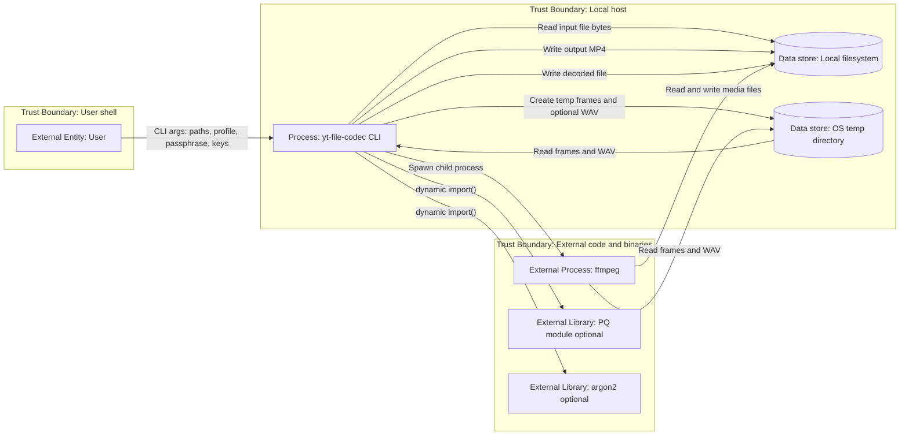
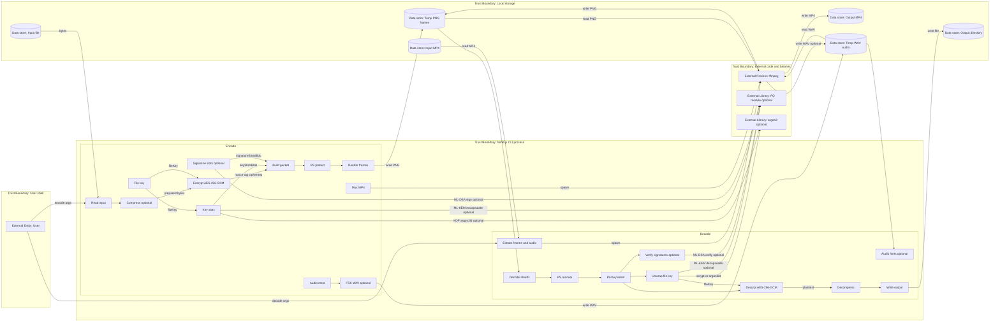
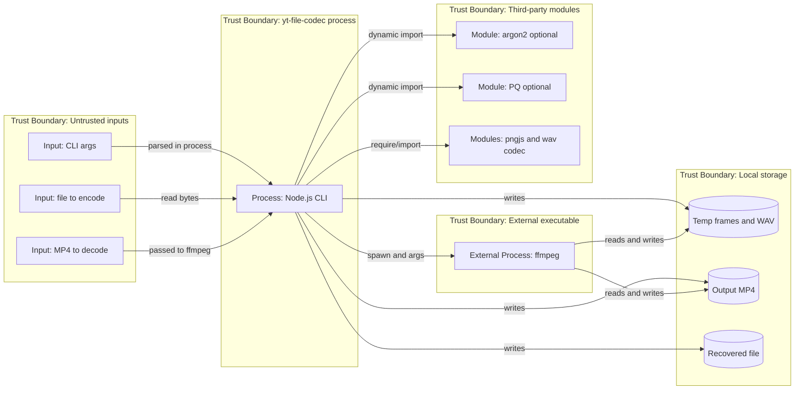
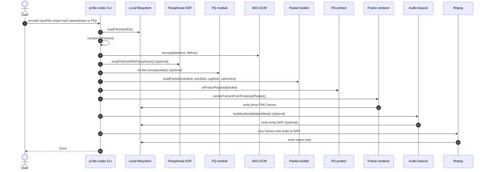
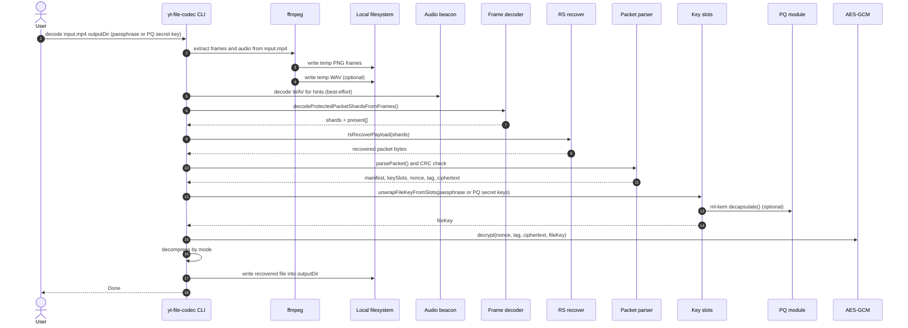
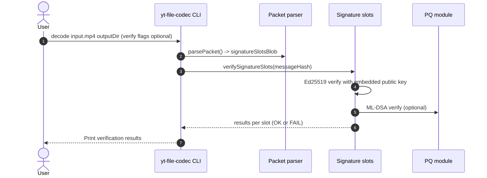

# Threat Model Review - 2026-02-25

> Method: Adam Shostack’s Four Questions (4Q) + STRIDE + OWASP mapping.
>
> Repository: yt-file-codec (Node.js CLI)

## 0. Executive summary

- Highest risk: decoding untrusted MP4s invokes an external ffmpeg process (memory safety and codec parsing exposure); treat ffmpeg as a hardened boundary and keep it updated/sandboxed. Evidence: [index.js](index.js#L261), [ffmpeg.js](ffmpeg.js#L4-L60)
- High risk: decode writes output path using attacker-controlled `originalName` from the packet; a crafted MP4 can cause path traversal and write outside `outputDir`. Evidence: [index.js](index.js#L379)
- High risk: passphrases are currently passed via CLI args (`--passphrase <text>`), which can leak via shell history, process listings, crash reports, or logs. Evidence: [index.js](index.js#L38-L48)
- Medium risk: metadata (original filename, sizes, manifest) is stored in the packet in plaintext (though embedded inside video frames); sharing the MP4 can leak filename and other attributes even without keys. Evidence: [packet.js](packet.js#L10-L28)
- Medium risk: supply-chain surface includes optional native `argon2` and optional PQ libraries loaded dynamically; a compromised dependency is a direct code execution path. Evidence: [passphrase_wrap.js](passphrase_wrap.js#L6-L9), [pq.js](pq.js#L4-L23)
- Solid: payload confidentiality and integrity are provided by AES-256-GCM; decrypt will fail on tampering without the file key. Evidence: [crypto.js](crypto.js#L3-L18)
- Solid: multiple integrity checks exist for robustness (packet CRC32, shard CRC32, RS recovery). Evidence: [packet.js](packet.js#L28-L50), [grid_rs.js](grid_rs.js#L148-L200)
- Unknown: intended threat posture (purely local/offline vs “download MP4s from internet and decode”) significantly changes required controls.

---

## 1. Scope

### In-scope components/containers

- Node.js CLI entrypoint and orchestration: [index.js](index.js#L1-L393)
- Cryptography primitives: [crypto.js](crypto.js#L3-L18)
- Packet format and CRC: [packet.js](packet.js#L4-L73)
- Key slots and passphrase/PQ wrapping: [key_slots.js](key_slots.js#L12-L79), [passphrase_wrap.js](passphrase_wrap.js#L13-L120), [pq.js](pq.js#L4-L112)
- Signature slots (Ed25519 and optional ML-DSA): [signatures.js](signatures.js#L18-L90)
- Video grid codec and shard CRC: [grid_rs.js](grid_rs.js#L128-L232)
- Reed–Solomon erasure coding: [rs_erasure.js](rs_erasure.js#L62-L109)
- Audio beacon metadata + FSK WAV: [audio_meta.js](audio_meta.js#L10-L57), [fsk.js](fsk.js#L58-L132)
- External process boundary: ffmpeg adapter: [ffmpeg.js](ffmpeg.js#L4-L60)

### Out-of-scope (not evidenced in repo)

- Any server/cloud deployment, upload to YouTube, authn/z, multi-user access control
- CI/CD hardening and publishing pipeline controls (no workflows observed under .github/workflows)

### Trust boundaries

- User shell → CLI process (untrusted args/paths)
- CLI process → external executable (ffmpeg)
- CLI process → third-party modules (optional argon2, optional PQ module)
- Local storage boundary (input MP4/file + temp files + outputs)

### Key assets (with sensitivity)

- Passphrase provided by user (Restricted)
- File key (32 bytes) used for AES-GCM (Restricted). Evidence: [index.js](index.js#L144)
- PQ secret keys used for decapsulation/signing (Restricted). Evidence: [key_slots.js](key_slots.js#L65-L78)
- Input file contents (Confidential/Restricted depending on user)
- Output MP4 (Confidential): contains ciphertext plus plaintext metadata (filename/manifest) and wrapped keys. Evidence: [packet.js](packet.js#L10-L28)
- Output recovered file (Confidential/Restricted)

---

## 2. Assumptions & Unknowns

- **ASSUMPTION:** Tool is primarily used locally/offline by a single user on their machine.
- **UNKNOWN:** Are decode inputs considered untrusted (e.g., MP4s downloaded from the internet)? Who can confirm: product owner/maintainer.
- **UNKNOWN:** Is revealing `originalName`/manifest acceptable when the MP4 is shared publicly? Who can confirm: product owner.
- **UNKNOWN:** Are users expected to run with elevated privileges (Administrator/root)? Who can confirm: maintainer.
- **UNKNOWN:** What environments matter most (Windows/macOS/Linux; corporate endpoints; sandboxes)? Who can confirm: maintainer.

---

## 3. Architecture & Data Flows (tool-validated Mermaid)

### 3.1 DFD Level 0 (Context)

**Evidence**
- CLI encode/decode, args, temp dirs, cleanup: [index.js](index.js#L1-L259) and [index.js](index.js#L260-L393)
- External ffmpeg process spawn boundary: [ffmpeg.js](ffmpeg.js#L4-L60)
- Optional module dynamic imports: [passphrase_wrap.js](passphrase_wrap.js#L6-L9), [pq.js](pq.js#L4-L23)

### 3.2 DFD Level 1 (Subsystems / Containers)

**Evidence**
- Encode pipeline orchestration and module calls: [index.js](index.js#L114-L245)
- Decode pipeline orchestration and module calls: [index.js](index.js#L261-L385)
- Packet + CRC: [packet.js](packet.js#L10-L73)
- Shard decode + shard CRC + majority vote: [grid_rs.js](grid_rs.js#L128-L232)
- RS protect/recover: [rs_erasure.js](rs_erasure.js#L62-L109)
- Key slots and PQ wrapping: [key_slots.js](key_slots.js#L12-L79)

### 3.3 Trust boundary view

**Evidence**
- ffmpeg spawn boundary: [ffmpeg.js](ffmpeg.js#L8-L60)
- Optional dependency loading: [passphrase_wrap.js](passphrase_wrap.js#L6-L9), [pq.js](pq.js#L4-L23)

---

## 4. Key Flows (ranked)

### Flow F1 — Encode (file → MP4)

- Description: reads an input file, optionally compresses, encrypts with AES-256-GCM, wraps file key into one or more key slots (passphrase and/or PQ recipients), optionally signs, RS-protects, renders PNG frames and optional WAV beacon, and muxes with ffmpeg. Evidence: [index.js](index.js#L114-L245)
- Data elements:
  - Input file bytes (Confidential/Restricted)
  - Passphrase (Restricted) Evidence: [index.js](index.js#L38-L48)
  - File key (Restricted) Evidence: [index.js](index.js#L144)
  - Ciphertext + nonce/tag (Confidential) Evidence: [crypto.js](crypto.js#L3-L10)
  - Manifest + originalName (Internal/Confidential metadata) Evidence: [packet.js](packet.js#L10-L28)
- Primary enforcement points:
  - AES-GCM authentication tag enforcement on decode. Evidence: [crypto.js](crypto.js#L12-L18)
  - Optional signatures for authenticity (if used). Evidence: [index.js](index.js#L173-L176), [signatures.js](signatures.js#L58-L90)

### Flow F2 — Decode untrusted MP4 (MP4 → recovered file)

- Description: invokes ffmpeg to extract frames and audio, decodes shards from frames with CRC checks, RS-recovers the packet, unwraps the file key from slots, decrypts, decompresses, writes output file. Evidence: [index.js](index.js#L261-L385)
- Sensitive boundary crossings:
  - External executable parsing untrusted media (ffmpeg). Evidence: [ffmpeg.js](ffmpeg.js#L55-L60)
  - Output file write based on packet `originalName`. Evidence: [index.js](index.js#L379)

### Flow F3 — Key unwrapping paths (passphrase slot vs PQ slot)

- Description: attempts passphrase unwrap first (if provided), then iterates PQ secret keys and PQ slots to decapsulate shared secrets and unwrap the file key. Evidence: [key_slots.js](key_slots.js#L55-L79)
- Data elements:
  - Wrapped key blob (Confidential)
  - PQ secret keys (Restricted)

### Flow F4 — Signature verification (optional)

- Description: if signature slots exist, verification is performed; Ed25519 uses embedded public key; ML-DSA uses embedded pk if present or caller-supplied pk. Evidence: [index.js](index.js#L342-L350), [signatures.js](signatures.js#L58-L90)

---

## 5. Threats

Legend: Likelihood and Impact are qualitative, assuming decode may be used on externally sourced MP4s.

| ID | Flow | Summary | STRIDE | OWASP | Likelihood | Impact | Status | Rationale |
|---|---|---|---|---|---|---|---|---|
| TM-01 | F1/F2 | Passphrase exposure via CLI args and shell history/process inspection | I | A02 Cryptographic Failures | H | H | Open | `--passphrase <text>` is part of normal usage; args can leak. Evidence: [index.js](index.js#L38-L48) |
| TM-02 | F2 | Path traversal on decode output using `originalName` from packet | T/E | A01 Broken Access Control | H | H | Open | Output path uses `path.join(outputDir, parsed.originalName ...)` without sanitization. Evidence: [index.js](index.js#L379) |
| TM-03 | F2 | ffmpeg exploitation via malicious MP4 leading to code execution | E | A06 Vulnerable and Outdated Components | M | H | Open | External binary parses attacker-controlled media; no sandboxing shown. Evidence: [ffmpeg.js](ffmpeg.js#L55-L60) |
| TM-04 | F1/F2 | Temp artifacts (frames/WAV) may remain on crash or abnormal exit | I | A09 Security Logging and Monitoring Failures | M | M | Open | Cleanup uses `rimraf(tmp)` at normal end; exceptions could leave temp dirs. Evidence: [index.js](index.js#L248-L249), [index.js](index.js#L384-L385) |
| TM-05 | F1 | Metadata leakage: original filename and manifest are plaintext in packet structure | I | A02 Cryptographic Failures | H | M | Open | `originalName` and manifest are serialized into packet body. Evidence: [packet.js](packet.js#L10-L28) |
| TM-06 | F1/F2 | Dependency/supply-chain compromise (argon2 native, PQ libs, png/wav libs) | T/E | A08 Software and Data Integrity Failures | M | H | Unknown | Dynamic imports and third-party libs expand trust base; repo lacks CI provenance checks. Evidence: [passphrase_wrap.js](passphrase_wrap.js#L6-L9), [pq.js](pq.js#L4-L23) |
| TM-07 | F3 | Offline brute-force of passphrase-wrapped key slot if passphrase is weak | I | A02 Cryptographic Failures | M | H | Open | Slot contains wrapped key + salt; attacker can attempt KDF guesses. Params are fixed; user entropy is key. Evidence: [passphrase_wrap.js](passphrase_wrap.js#L13-L80) |
| TM-08 | F2 | Denial of service via huge MP4/frames causing heavy CPU/memory usage | D | A04 Insecure Design | M | M | Open | Decoder iterates multiple candidates and processes many PNGs; no explicit limits. Evidence: [index.js](index.js#L295-L323), [grid_rs.js](grid_rs.js#L158-L232) |
| TM-09 | F2 | Decompression bomb after decryption (gzip/brotli) | D | A04 Insecure Design | L | M | Open | Decompression runs after successful decrypt; attacker needs victim to decrypt their payload (social/operational). Evidence: [index.js](index.js#L122-L129), [index.js](index.js#L377-L380) |
| TM-10 | F4 | Confusing authenticity expectations when signature slots are absent | R/I | A04 Insecure Design | M | M | Open | Encryption protects confidentiality/integrity but not “who created it” unless signatures are used and verified. Evidence: [signatures.js](signatures.js#L18-L90) |
| TM-11 | F1/F2 | Secrets in memory (fileKey, passphrase) not zeroized; possible leak via crash dumps | I | A02 Cryptographic Failures | L | M | Unknown | Node.js runtime and Buffers are not zeroized by default; no explicit hardening shown. Evidence: [index.js](index.js#L144-L151) |
| TM-12 | F2 | Audio beacon used for hints might be spoofed and mislead auto-detection | T | A04 Insecure Design | L | L | Mitigated | Audio is explicitly “non-fatal” and verified against video payload when possible. Evidence: [index.js](index.js#L263-L289), [index.js](index.js#L352-L372), [audio_meta.js](audio_meta.js#L53-L57) |

---

## 6. Mitigations

| Threat ID | Mitigation | Status | Location / Evidence | Notes |
|---|---|---|---|---|
| TM-01 | Avoid secrets in argv (stdin/file prompt) | ABSENT | Evidence of current argv usage: [index.js](index.js#L38-L48) | Consider `--passphrase-stdin` or interactive prompt; document operational guidance meanwhile. |
| TM-02 | Sanitize `originalName` on decode and enforce outputDir containment | ABSENT | [index.js](index.js#L379) | Strongly recommend restricting to basename and rejecting path separators and `..`. |
| TM-03 | Sandbox/contain ffmpeg, restrict inputs, keep ffmpeg updated | ABSENT | ffmpeg invoked: [ffmpeg.js](ffmpeg.js#L55-L60) | Containment options depend on OS (AppContainer/Job Object, seccomp, container). |
| TM-04 | Ensure temp cleanup on all failure paths | ABSENT | Cleanup only at normal completion: [index.js](index.js#L248-L249), [index.js](index.js#L384-L385) | Wrap encode/decode bodies in `try/finally` to guarantee cleanup. |
| TM-05 | Encrypt or minimize metadata; optionally hide filename/manifest | ABSENT | Packet structure: [packet.js](packet.js#L10-L28) | If public sharing is common, consider storing `originalName` encrypted or omit by default. |
| TM-06 | Dependency pinning, provenance, SCA, SBOM, verify optional modules | UNKNOWN | Dynamic import: [passphrase_wrap.js](passphrase_wrap.js#L6-L9), [pq.js](pq.js#L4-L23) | Add CI checks if this is distributed widely. |
| TM-07 | Strong KDFs and higher-cost defaults; allow user-configured KDF params | PARTIAL | scrypt + optional argon2id present: [passphrase_wrap.js](passphrase_wrap.js#L13-L80) | Params are hard-coded in CLI for argon2id and scrypt: [index.js](index.js#L151-L157). |
| TM-08 | Resource limits (max frames, max temp dir size, timeouts) | ABSENT | Candidate scanning: [index.js](index.js#L295-L323) | If decode is used on untrusted inputs, add safe limits/timeouts. |
| TM-10 | Clear UX: require verification for “authentic” mode | PARTIAL | Sign/verify supported: [index.js](index.js#L173-L176), [index.js](index.js#L342-L350) | Consider a mode that fails decode when signature verification fails/absent. |
| TM-12 | Beacon verified against video payload and treated as non-fatal | PRESENT | Verification: [index.js](index.js#L352-L372), [audio_meta.js](audio_meta.js#L53-L57) | Good defense against spoofed hint audio. |

---

## 7. High-risk interaction sequences (tool-validated)

### Sequence S1 — Encode file → MP4

**Evidence**
- Encode orchestration: [index.js](index.js#L114-L245)
- AES-GCM: [crypto.js](crypto.js#L3-L10)
- Passphrase wrap: [passphrase_wrap.js](passphrase_wrap.js#L44-L81)
- PQ encapsulate: [pq.js](pq.js#L38-L58)
- ffmpeg mux: [ffmpeg.js](ffmpeg.js#L19-L52)

### Sequence S2 — Decode MP4 → recovered file

**Evidence**
- Decode orchestration: [index.js](index.js#L261-L385)
- ffmpeg extract: [ffmpeg.js](ffmpeg.js#L55-L60)
- Shard decoding and CRC checks: [grid_rs.js](grid_rs.js#L158-L200)
- Output path join risk: [index.js](index.js#L379)

### Sequence S3 — Signature verification reporting

**Evidence**
- Verification callsite: [index.js](index.js#L342-L350)
- Ed25519 verify: [signatures.js](signatures.js#L64)
- ML-DSA verify with embedded pk preference: [signatures.js](signatures.js#L71-L79)

---

## 8. Validation plan (no code)

1) **Path traversal safety check (TM-02)**
- Intent: confirm decode cannot write outside outputDir.
- Preconditions: create or obtain an MP4 where packet `originalName` contains `../` or an absolute path.
- Steps: run decode into a controlled outputDir; monitor file writes.
- Expected: tool rejects unsafe names or writes only inside outputDir.
- Evidence to collect: file system audit (created files), console output.
- Owner: maintainer + security reviewer.

2) **Untrusted MP4 hardening check (TM-03)**
- Intent: quantify ffmpeg risk and decide sandboxing requirements.
- Preconditions: set of malformed/corrupt MP4s (and optionally known fuzz corpora).
- Steps: run decode under a constrained environment; watch for crashes and unexpected behavior.
- Expected: no process compromise; failures are handled as errors.
- Evidence to collect: crash logs, Windows Event Log / core dumps, ffmpeg version output.
- Owner: maintainer.

3) **Secret handling operational review (TM-01)**
- Intent: ensure no passphrases appear in logs/history.
- Steps: run encode/decode; check shell history, process explorer output, crash reports.
- Expected: secrets not recorded outside user input channel.
- Evidence to collect: screenshots/log snippets, documented guidance.
- Owner: maintainer.

4) **Temp artifact persistence check (TM-04)**
- Intent: verify temp dirs are removed on failures.
- Steps: kill the process mid-encode and mid-decode; inspect OS temp for `ytfc-enc-*`/`ytfc-dec-*`.
- Expected: minimal sensitive residue; documented cleanup steps.
- Evidence to collect: directory listings before/after, reproduction notes.
- Owner: maintainer.

5) **Authenticity expectations check (TM-10)**
- Intent: validate that signature verification is clear and actionable.
- Steps: encode with Ed25519 signing; decode and confirm "Signature ed25519: OK"; then tamper MP4 and confirm FAIL.
- Expected: users can reliably detect tampering/impersonation when signatures are used.
- Evidence to collect: command transcript, output logs.
- Owner: maintainer.

---

## 9. Owners

- Who confirms assumptions: **UNKNOWN** (maintainer/product owner)
- Who drives mitigations: maintainer
- Who validates fixes: security reviewer + maintainer

---

## 10. Open questions

- Is decoding arbitrary internet MP4s in-scope? Owner: product owner. Where to look: README usage expectations in [README.md](README.md)
- Is metadata confidentiality (original filename/manifest) required? Owner: product owner. Evidence: [packet.js](packet.js#L10-L28)
- Should signatures be mandatory in some mode (fail decode if missing/FAIL)? Owner: maintainer. Evidence: [index.js](index.js#L342-L350)
- What OS-level sandboxing is acceptable for ffmpeg on Windows? Owner: maintainer/ops.

---

## ✅ Quality checks

- Diagrams included: DFD L0, DFD L1, trust boundary, 3 sequences.
- All Mermaid diagrams were validated using `mermaid-diagram-validator`.
- PRESENT mitigations include concrete code references.
- UNKNOWN items have follow-up questions and owners.
